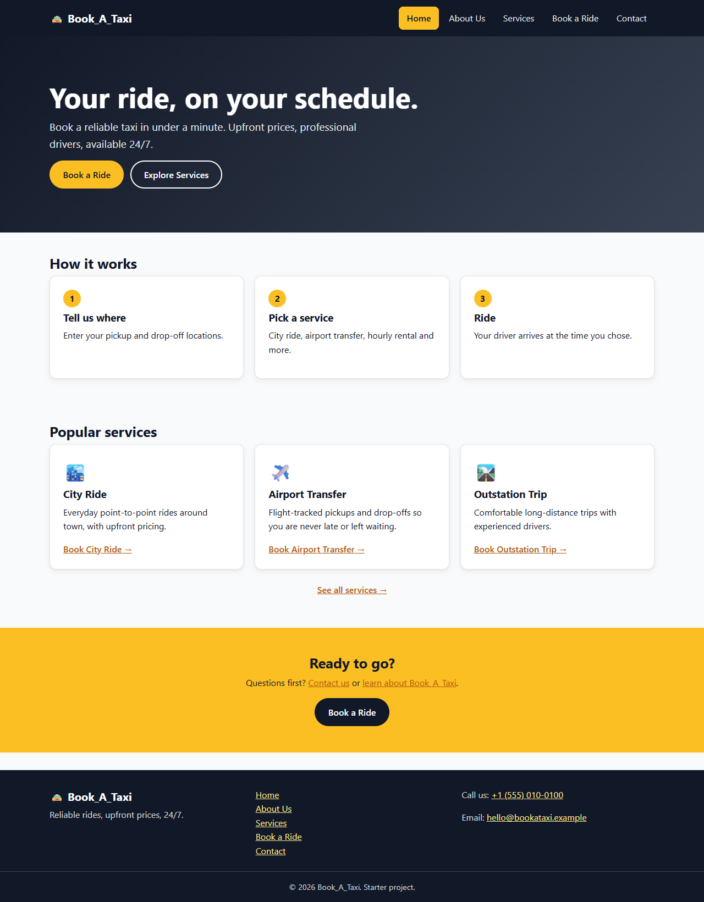
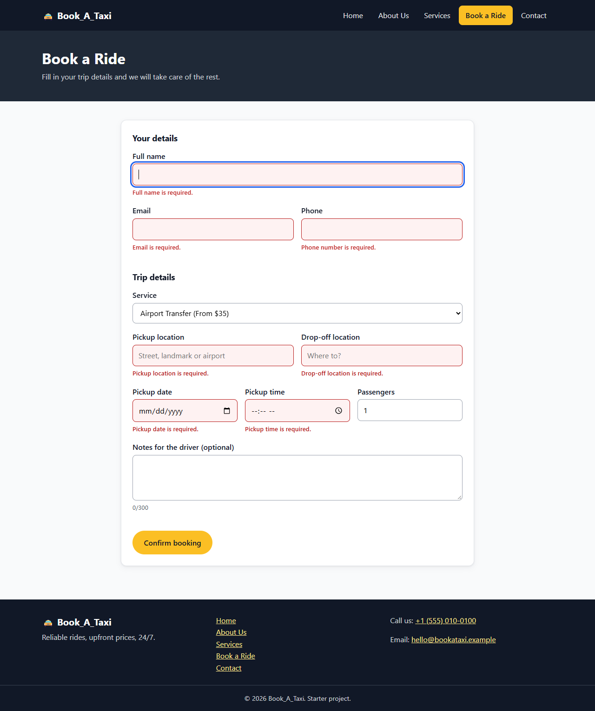
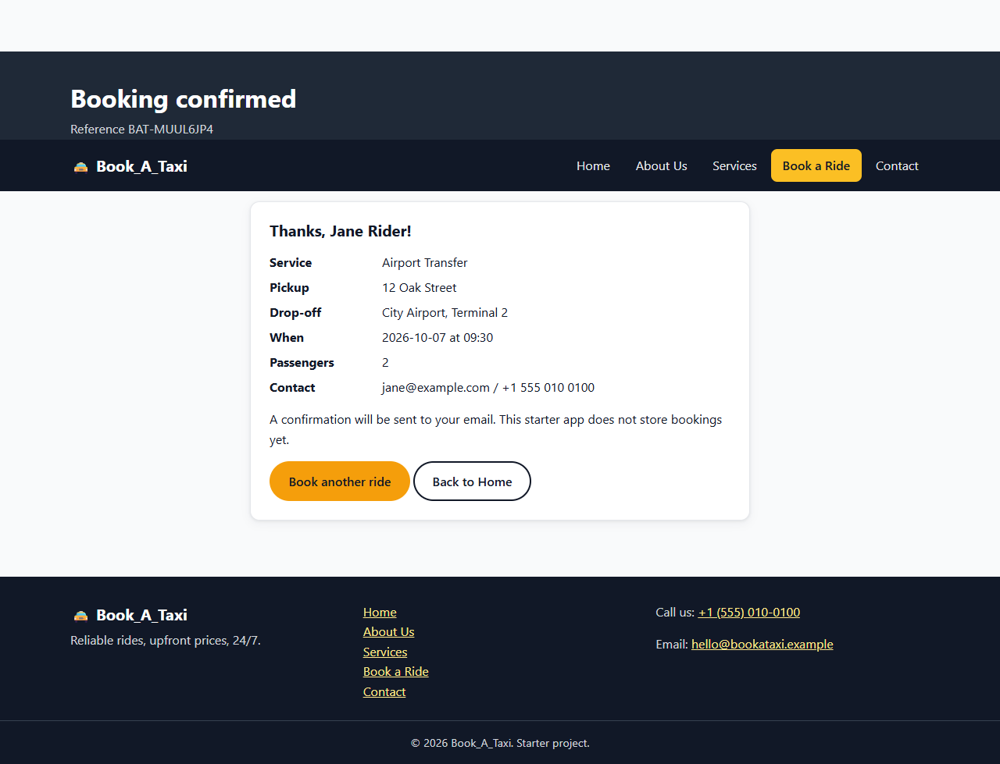

# Book_A_Taxi

Front-end starter for a taxi ride booking website: a homepage, About Us,
Services and Contact pages, and a booking page with form validation.

## Tech Stack

- React (Vite)
- React Router for page navigation
- Plain CSS, no UI library

## Getting Started

```bash
npm install
npm run dev
```

Then open http://localhost:5173.

Other scripts:

```bash
npm run build     # production build
npm run lint      # oxlint
npm run preview   # serve the production build
```

## Pages

| Route | Page |
| --- | --- |
| `/` | Home: hero, how it works, popular services |
| `/about` | About Us |
| `/services` | Services (each card links to the booking page with that service pre-selected) |
| `/book` | Book a Ride (validated booking form + confirmation) |
| `/contact` | Contact (validated contact form) |
| `*` | 404 page |

Every page shares the same layout, so the navigation bar and footer link to all
pages from everywhere. The links are defined once in `src/data/navLinks.js`.

## Booking Form Validation

Validation lives in `src/utils/validation.js` and runs on blur, on change after a
field has been visited, and on submit. Errors appear inline under each field, the
first invalid field is focused on submit, and fields use `aria-invalid` /
`aria-describedby` for screen readers.

- Full name: required, at least 2 characters
- Email: required, valid format
- Phone: required, 7-15 digits
- Service: required (pre-filled from `/book?service=<id>`)
- Pickup and drop-off: required, and must differ
- Date: required, not in the past
- Time: required, not in the past when the date is today
- Passengers: whole number from 1 to 8
- Notes: optional, up to 300 characters

On success the page shows a confirmation summary with a booking reference. There
is no backend yet, so bookings are not stored.

## Project Structure

```
src/
  components/   Layout, Navbar, Footer, PageHeader, FormField
  pages/        Home, About, Services, Booking, Contact, NotFound
  data/         navLinks.js, services.js
  utils/        validation.js
docs/screenshots/   App screenshots
```

## Screenshots

| Home | Booking validation | Confirmation |
| --- | --- | --- |
|  |  |  |
